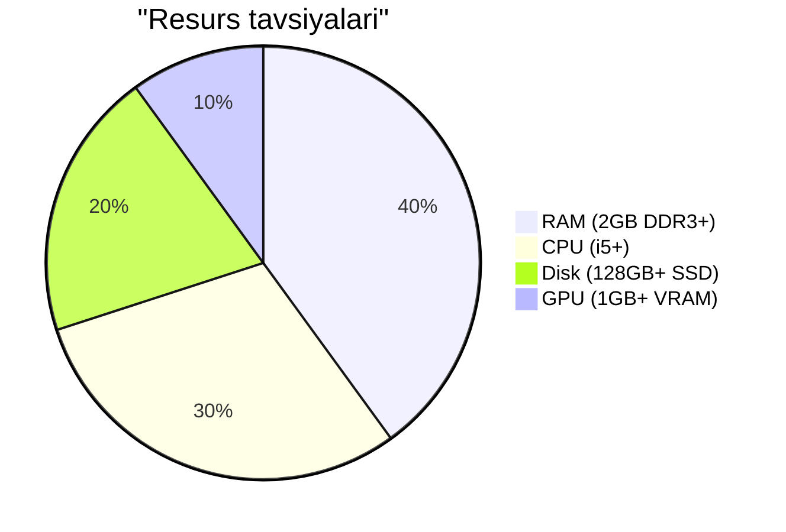

<!-- Banner -->
<p align="center">
  
  
  
  
</p>

---

# 🖥️ VIP OS

**VIP OS** — muhandislar, kiber xavfsizlik mutaxassislari va Linux’ni endi o‘rganayotganlar uchun mo‘ljallangan **ochiq manbali va bepul** operatsion tizim.  
Har bir foydalanuvchi tizim kodini o‘zgartirishi, yangilashi yoki o‘z hissasini qo‘shishi mumkin.

---

## 📌 VIP OS haqida

- **Live Build** asosida yaratilgan — USB fleshka yoki tashqi xotiradan ishlay oladi
- Ma’lumotlarni saqlash yoki saqlamaslik rejimi mavjud
- Kiber xavfsizlik vositalari oldindan o‘rnatilgan
- Kali Linux’ning har qanday tool’ini o‘rnatish imkoniyati:
  ```bash
  sudo apt install tool_nomi -t kali-rolling
  ```
- Har xil desktop muhitlari bilan ishlash imkoniyati (Xfce, MATE, Openbox, i3, va boshqalar)
- Minimal resurs talab qiladigan variantlar mavjud (masalan, Openbox)

---

## 🚀 Asosiy xususiyatlar

- 🎨 Qulay va sozlanadigan desktop muhiti  
- ⚡ Tizim resurslarini samarali ishlatadi  
- 🔒 Ko‘plab kiber xavfsizlik vositalari  
- 📦 **APT** orqali qo‘shimcha tool’larni o‘rnatish  
- 🛠 Ochiq kod — hamjamiyat tomonidan qo‘llab-quvvatlanadi  
- 💽 To‘liq USB’dan ishlash imkoniyati  

---

## 💻 Minimal va tavsiya etilgan sistem talablari

| Talab turi     | Minimal                         | Tavsiya etiladi                |
|----------------|--------------------------------|---------------------------------|
| **RAM**        | 1–2 GB DDR3 (3200 MHz)          | 2 GB DDR3 yoki yuqoriroq        |
| **CPU**        | Intel Core i3 (5-avlod)         | Core i5 yoki yuqoriroq          |
| **GPU**        | 512 MB (istalgan turdagi)       | 1 GB VRAM yoki yuqoriroq        |
| **Disk**       | 64 GB                           | 128 GB yoki yuqoriroq SSD       |

---



---

## 📸 Ekran tasvirlari

1. **🚀 Boot menyu**  
   VIP OS’ni ishga tushirish yoki o‘rnatish varianti tanlanadi (*Try or Install VIP OS*).  
   

2. **⚙️ Birinchi sozlash oynasi**  
   Ishga tushganda `i3: first configuration` oynasi chiqadi — **ENTER** tugmasini bosing.  
   

3. **⌨️ ALT variantini tanlash**  
   ALT varianti belgilab, **ENTER** tugmasi bosiladi.  
   

4. **🖥 i3 Desktop muhiti**  
   Minimalistik, tezkor va kuchli sozlash imkoniyatiga ega:  
   - Terminal: **ALT+ENTER**  
   - Chiqish: **ALT+SHIFT+E** → *Yes, exit i3*  
   

5. **🔑 Login oynasi**  
   Kirish ma’lumotlari:  
   - `testuser / testuser`  
   - `vipuser /` *(parolsiz)*  
   Yuqori o‘ng burchakdan kerakli desktop muhitini tanlash mumkin (**Xfce** tavsiya etiladi).  
   

6. **💻 Openbox Desktop muhiti**  
   Eng yengil va eng minimalistik variant — past resursli kompyuterlar uchun ideal:  
   - Juda kam xotira va CPU iste’moli  
   - Soddaligi sabab yangi foydalanuvchilar uchun qulay  
   - Dasturlar ro‘yxati: sichqonchani **o‘ng tugmasini** bosing  
   

7. **💻 Xfce Desktop muhiti**  
   Qulay va intuitiv interfeys, menyu va sozlanadigan panelga ega. Tezkor ishlaydi va ko‘p foydalanuvchilar uchun asosiy tanlov bo‘la oladi.  
   

---

## 📥 Yuklab olish

[](MEGA_LINK_BU_YERGA_QO‘YILADI)

---

## 📞 Aloqa

- 👤 **Muallif:** VIP  
- 📢 **Telegram (shaxsiy):** [Xorazmlik_2004](https://t.me/Xorazmlik_2004)  
- 💬 **VIP OS bo‘yicha savollar:** [Xora7m](https://t.me/Xora7m)  

---

## 📜 Litsenziya

[](#)  
VIP OS — mutlaqo bepul va ochiq manbali tizim. Foydalanish, o‘zgartirish va tarqatish erkin.
